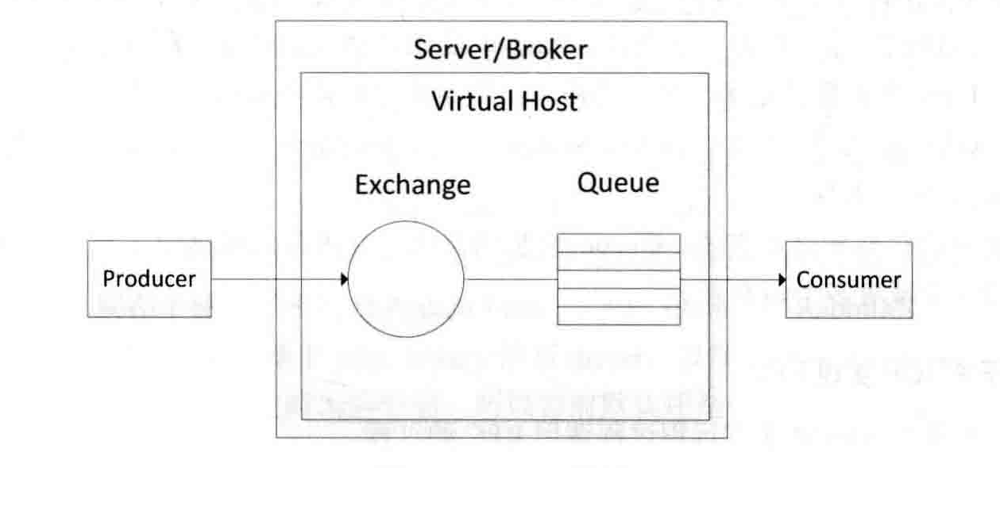
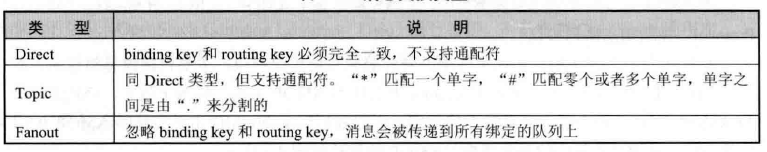
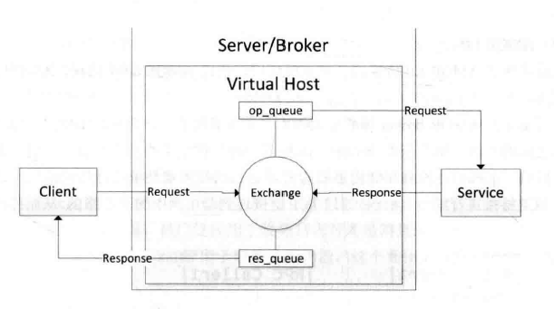
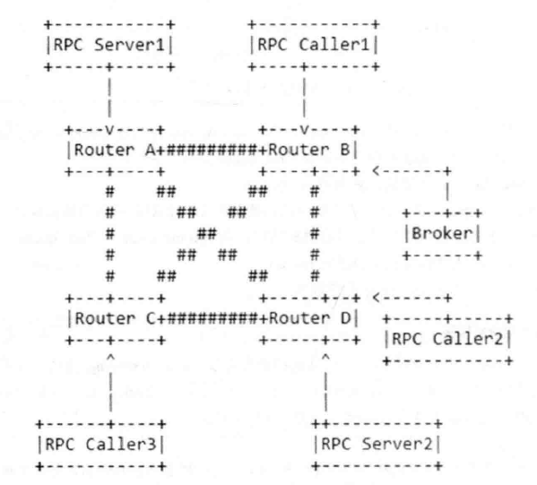
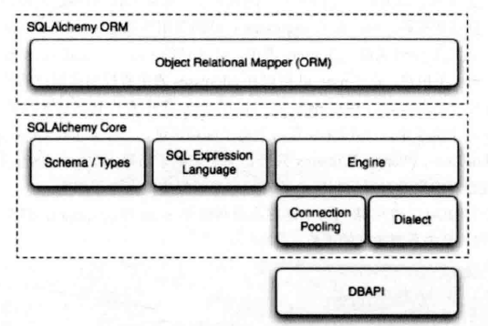

# Open Stack通用技术
## 1.消息总线
>设计原则：
> - 项目之间通过 `TESTful API` 进行通信
> - 项目内部，不同的进程之间的通信必须通过消息总线。

- -->保证对外服务的接口被不同类型客户端支持
- -->项目内部通信接口可扩展和可靠性，支持大规模部署
### `消息总线` 定义
>一些服务向总线发送消息，其他服务从总线上获取消息

### 1.1 OpenStack消息总线项目内部通信实现方法
>（oslo.messaging）
- `RPC` (Remote Procedure Call,远程过程调用)
  - `call` 调用，同步
  - `cast` 调用，异步
- `Event Notification` （事件通知）
  - 所有对此类事件的服务进程都可以获取此通知并进一步处理
  - 处理结果不会返回发送者
  - 可项目内部，可跨项目
  - ceilometer以此进行计量和监控
#### 1.1.1 `AMQP` (Advanced Message Queuing Protocol,高级消息队列协议)
- 异步消息传递
- 开放的应用层协议
- 包括消息导向、队列、路由、可靠性及安全性
- Oslomessaging支持AMQP0.9.1&1.0
- `AMQP`架构如图IMG1-1所示↓

> - Exchange决定消息的路由，即交给指定Queue，供Consumer提取
> - Binding（绑定）当条件C匹配时，队列Q被绑定到交换E上
> - `router key` & `binding key` ：每一个发送的消息都有一个router key，每一个队列也有一个binding key，采取匹配原则
> - 如表AMQP中的Exchange类型↓
 
#### 1.1.2 基于AMQP实现RPC
实现过程如图所示 `↓`

#### 1.1.3 常见的消息总线实现
- `RabbitMQ` 中间件服务
  - 包括Server/Broker
  - 支持多种协议网关（HTTP、STOMP、MQTT）
  - 支持多语言（erlang、Java、.NET Framework）
  - oslo.messageing底层实现了kombu和pika两种driver支持RabbitMQ——pika更加完备，现阶段默认使用Kombu
- `AMQP1.0`
  - 比0.9.1更复杂和灵活
  - 消息路由模式，路由网替代单节点
  - 节点不具备queue存储能力
  - 节点之间使用TCP链接通信，调用者通过TCP连接到路由接入路由网
  - 冗余节点提高服务高可用性
  - 如图所示消息路由 ↓
- `0QM` (ZeroMQ)
  - 开源高性能异步消息库
  - 可在无Serv/Broker情况下工作
- `Kafka`
  - 分布式消息编写
  - Scala编写
  - 扩展能力好、高吞吐量
### 1.2 `SQLAlchemy`和数据库
##### 1.2.1 `SQLAlchemy` 
- `SQLAlchemy Core` 核心
  - SQL语言表达式
  - 数据引擎
  - 连接池
- `SQLAlchemy ORM` 对象关系映射器
  - 数据映射模式（ORM，Object Relational Mapper）
  - 支持事务处理
  - 
`SWLAlchemy`结构图如下 ↓

### 1.3`RESTful API` & `WSGI`
> 通过`RESTful API`向外提供服务 → OpenStack接口在性能、可扩展性、可移植性、易用性平衡
#### 1.3.1 `RESTful`
- 定义：
  - 互联网软件架构
  - 若结构符合REST（Representational State Transfer，表属性状态转移）原则，称为RESTful架构
- 核心概念：资源（Resource）
  - 每个资源对应一个特定的URI（统一资源定位符），只代表资源实体，并不能代表其表现形式
  - 资源的表述（Representation），客户端和服务端互动传递就是资源的表述，客户端对服务端资源的操作就是表述性的状态转换
#### 1.3.2 `RESTful`路由
OpenStack各个项目都提供了RESTful架构的API作为对外接口，而RESTful的核心就是资源与资源上的操作
-->Openstack定义了很多的资源，并实现了对这些资源的各种操作的函数
- 路由模块Routes源于对Rails路由系统的重新实现
  - Rails（Ruby on Rails）：Ruby语言Web开发框架、使用MVC模式
- 当浏览器发出请求后，Rails路由系统会将这个请求指派到对应的Controller
- 每个Controller对应一个RESTful资源，代表了对该资源的操作集合，包含很多Action，包含Http请求和回应
- Nova客户端（Novaclient）将这个命令转换成HTTP请求噶给Nova的API服务进程
#### 1.3.3 `WSGI`
- 定义：WSGI（Web Server Gateway Interface，Web服务器网关接口）
  - Python语言中所定义的web服务器和web应用程序或框架之间的通用接口标准
  - 作用：在协议之间进行转换
- WSGI将web组件分为
  - web服务器（WSGI Server）：接收HTTP请求，封装一系列环境变量，按接口标准调用注册的application，最后将响应返回客户端
  - web中间件（WSGI Middleware）：两端API，起协调作用，负责路由
  - web应用程序（WSGI Application）：可被调用的Python对象，接收两个参数environ和start_response
    - environ指向一个Python字典，至少包含CGI（通用网关接口规范）中定义的环境变量
    - start_response指向一个回调函数：包含status(响应状态),response_headers(包含了HTTP响应中断头以及内容的元祖列表),exc_info(一般在出现错误的时候使用，让浏览器显示相关错误信息)
#### 1.3.4 `Paste`
使用Paste的Deploy组件完成对WSGI服务器和应用的构建
#### 1.3.5 `WebOb`
对WSGI的请求和响应进行封装，简化WSGI应用的编写
- webob.Request：对environ参数进行封装
- webob.Response：包含了标准WSGI响应的所有要素
- webob.exc：对HTTP错误代码进行封装
- 修饰符webob.dec.wsgify：可以不使用原始WSGI参数和返回格式，全部使用WebOb代替
#### 1.3.6 `Pecan`
轻量级WSGI网络框架，主要解决对象路由和Restful支持，并不提供对话(session)和数据库支持